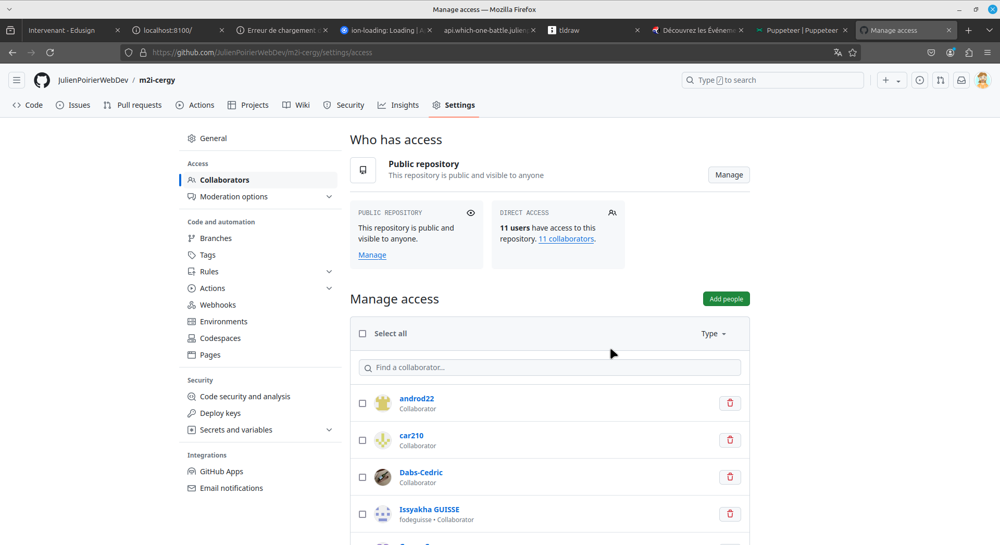

# Evaluation

Cette évaluation se compose d'une app Ionic composé de plusieurs pages et consommant deux api disctinctes. Il n'y a pas de cohérence entre les deux parties de l'app, il s'agit simplement d'un exercice de mise en pratique.

La première api est `https://tyradex.vercel.app/`, une API sur POKEMON :

-   `https://tyradex.vercel.app/api/v1/pokemon` pour la liste des pokemons
-   `https://tyradex.vercel.app/api/v1/pokemon/:id` pour un pokemon en particulier

La seconde api est `http://movies-api.julienpoirier-webdev.com/`, une API sur les films et les series :

-                       `http://movies-api.julienpoirier-webdev.com/search/movies/:query`
-                       http://movies-api.julienpoirier-webdev.com/infos/movies/:id pour un film en particulier
-                       http://movies-api.julienpoirier-webdev.com/search/series/:query pour les series
    -   `http://movies-api.julienpoirier-webdev.com/infos/series/:id` pour une serie en particulier

## Workflow

Vous allez travailler a 2 ou 3, il faut donc être organisé. Celui qui a créer le projet doit donner les autorisations aux autres pour qu'ils puissent eux aussi écrire dessus.



Une fois le nom d'utilisateur de vos camarades ajouté, ils recevront un mail et devront accepter l'invitation.

Vous pouvez travailler a 3 sur le même écran en partage sur TEAMS ou bien vous répartir le travail et chacun créer une branche sur GITHUB pour votre travail. Si vous faites des branches, pensez a bien faire des pull requests. Si vous travaillez a 3 sur MAIN, vous risquez d'avoir des conflicts.

## Etape 1

Créer une application IONIC avec les commandes habituelles. Choisissez le template TABS qui vous fournira un menu tout fait.
Créer un repository github et sauvegarder votre travail dessus.

## Etape 2

Créer une page qui affiche la liste des pokemons. Vous devrez consommer l'api `https://tyradex.vercel.app/pokemon` pour afficher les pokemons. Vous pouvez afficher les pokemons sous forme de liste ou de carte, c'est vous qui voyez.

Cette page sera le premier onglet de votre application.

Affichez au minimum le nom et l'image du pokemon.

Pour vous aider, voici le type de données que vous pouvez récupérer :

```tsx
type Pokemon = {
	pokedex_id: number;
	generation: number;
	category: string;
	name: {
		fr: string;
		en: string;
		jp: string;
	};
	sprites: {
		regular: string;
		shiny: string;
		gmax: string | null;
	};
	types: {
		name: string;
		image: string;
	}[];
	talents: {
		name: string;
		tc: boolean;
	}[];
	stats: {
		hp: number;
		atk: number;
		def: number;
		spe_atk: number;
		spe_def: number;
		vit: number;
	};
	resistances: {
		name: string;
		multiplier: number;
	}[];
	evolution: {
		pre:
			| {
					pokedex_id: number;
					name: string;
					condition: string;
			  }[]
			| null;
		next:
			| {
					pokedex_id: number;
					name: string;
					condition: string;
			  }[]
			| null;
		mega:
			| {
					orbe: string;
					sprites: {
						regular: string;
						shiny: string;
					};
			  }[]
			| null;
	};
	height: string;
	weight: string;
	egg_groups: string[];
	sexe: {
		male: number;
		female: number;
	};
	catch_rate: number;
	level_100: number;
	formes: any;
};
```

Idéalement, vous devriez afficher :

-   Le nom du pokemon
-   L'image du pokemon
-   Les types du pokemon
-   Les résistances du pokemon (optionnel)
-   L'évolution du pokemon (optionnel)
-   La taille du pokemon (optionnel)
-   Le poids du pokemon (optionnel)

Bonus :

-   Ajouter un selecteur de type.
-   Ajouter un champ de recherche pour filtrer les pokemons par nom.
-   Utiliser une grid pour afficher les pokemons (et n'avoir que 2 ou 3 colonnes par exemple).

## Etape 3

Créer une page qui affiche les détails d'un pokemon. Vous devrez consommer l'api `https://tyradex.vercel.app/v1/pokemon/` pour afficher les détails du pokemon. Vous pouvez afficher les détails sous forme de liste ou de carte, c'est vous qui voyez.

Bonus :

-   Permettre d'arriver sur la page de détails d'un pokemon en cliquant sur un pokemon de la liste.
-   Ajouter un bouton pour revenir à la liste des pokemons.
-   Ajouter des boutons pour naviguer entre les pokemons (précédent et suivant).

## Etape BONUS

Utiliser le plugin capacitor "cookie" ou "storage" pour sauvegarder les pokemons favoris de l'utilisateur. Vous pouvez ajouter un bouton "Ajouter aux favoris" sur la page de détails d'un pokemon et un onglet "Favoris" dans le menu de votre application.

TIPS :

-   Vous pouvez sauvegarder les favoris sous forme de tableau d'id de pokemons.

```jsx
const [favoris, setFavoris] = useState([]);

const addFavorite = (id) => {
	setFavoris([...favoris, id]);
};

const removeFavorite = (id) => {
	setFavoris(favoris.filter((fav) => fav !== id));
};
```

-   Dans l'onglet "Favoris", il faudra charger a nouveau tous les pokemons pour afficher les favoris. Il faudra alors vérifier si l'id du pokemon est dans le tableau des favoris pour l'afficher.

## Etape 4

Mettre a jour les tabs de votre application pour qu'ils aient des icônes et des titres :

-   Le premier onglet s'appellera "Pokemons" et aura l'icone de votre choix
-   Le second onglet s'appellera "Films" et aura l'icone de votre choix

## Etape 5

Créer une page qui affiche la liste des films. Vous devrez consommer l'api `http://movies-api.julienpoirier-webdev.com/search/movies/:query` pour afficher les films. Vous pouvez afficher les films sous forme de liste ou de carte, c'est vous qui voyez.

Cette page sera le second onglet de votre application.

Il vous faudra un champ de recherche pour chercher un film par titre. (il existe un composant ion-searchbar, que vous pouvez utiliser)

### Attention /!\
Pour afficher une image, il faut utiliser cette url : `https://image.tmdb.org/t/p/w500/` + `chemin de l'image`(backdrop_path ou poster_path)

Par exemple, pour Terminator, le poster_path est `/RtFOHF93zW4kTp4JOYrH71vxBh.jpg`

Donc le chemin d'accès a l'image est : `https://image.tmdb.org/t/p/w500/mRtFOHF93zW4kTp4JOYrH71vxBh.jpg`

Affichez au minimum le titre et l'image du film.

Idéalement, vous devriez afficher :

-   Le titre du film
-   L'image du film
-   La date de sortie du film
-   Un morceau du synopsis du film

Bonus : - Ajouter les 100 premiers characters du synopsis

## Etape 6

Créer une page qui affiche les détails d'un film. Vous devrez consommer l'api `http://movies-api.julienpoirier-webdev.com/infos/movies/:id` pour afficher les détails du film. Vous pouvez afficher les détails sous forme de liste ou de carte, c'est vous qui voyez.

Vous pouvez afficher :

-   Le titre du film
-   L'image du film
-   La date de sortie du film
-   Le synopsis du film
-   La durée du film
-   Les genres du film
-   Le nom original du film
-   Le nom des pays de production
-   Les langues parlées dans le film
-   La tagline du film
-   Le budget du film
-   S'il appartient a une collection et le nom de la collection

Bonus :

-   Il y a une image backrop_path qui est plus grande que l'image poster_path, vous pouvez l'afficher en fond de votre page de détails, faites un truc joli.
-   Ajouter un bouton pour revenir à la liste des films.
-   Afficher les genres

## Etape 7

Si le film appartient a une collection, vous pouvez afficher les autres films de la collection. Pour cela, vous pouvez consommer l'api `http://movies-api.julienpoirier-webdev.com/infos/collections/:id`.
Vous pouvez afficher les films de la collection sous forme de liste ou de carte, c'est vous qui voyez.

Bonus :

-   On peut cliquer sur un film de la collection pour afficher les détails du film et ainsi avoir une navigation infinie.

## Etape 8

Permettre la pagination sur la liste des films. Vous pouvez consommer l'api `http://movies-api.julienpoirier-webdev.com/search/movies/:query/:page` pour afficher les films. Vous pouvez afficher les films sous forme de liste ou de carte, c'est vous qui voyez.

Il faudrait ajouter un bouton "Suivant" et "Précédent" pour naviguer entre les pages.

Bonus :

-   Aller a la dernière page
-   Aller a la première page
